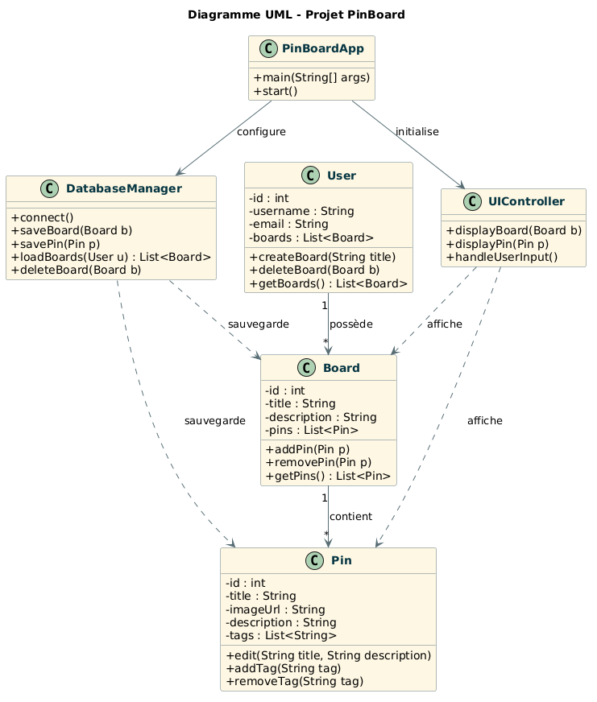

---

# 📌 PinBoard  
Éditeur graphique JavaFX — Dessins vectoriels extensibles

PinBoard est un **éditeur de dessins vectoriels** développé en JavaFX.  
Il repose sur une architecture **extensible**, permettant d’ajouter facilement de nouvelles fonctionnalités grâce à des **interfaces**, de la **délégation**, et des **design patterns** bien structurés.

---

## Fonctionnalités principales

- Création et édition de formes vectorielles  
- Interface JavaFX fluide et réactive  
- Architecture modulaire permettant d’ajouter des outils ou formes personnalisées  
- Gestion des objets graphiques via un système de délégation  
- Extensibilité pensée dès la conception (patterns : Strategy, Factory, Composite, etc.)

---

## Structure du projet

Le dépôt contient les éléments suivants :

```
PinBoard/
├── src/               # Code source Java
│   └── pobj/          # Package principal contenant la logique de l’éditeur
├── .settings/         # Configuration Eclipse
├── .classpath         # Fichier de configuration du projet Java
├── .project           # Métadonnées du projet Eclipse
├── .gitignore         # Fichiers ignorés par Git
├── .gitlab-ci.yml     # Pipeline CI
└── README.md          # Documentation du projet
```

---

## Technologies utilisées

| Domaine | Technologie |
|--------|-------------|
| Langage | **Java** |
| Interface graphique | **JavaFX** |
| IDE recommandé | Eclipse / IntelliJ |
| Build | JDK standard |
| CI	| GitLab CI |

---

## Installation & lancement

### 1. Cloner le dépôt
```bash
git clone https://github.com/KasselFelix/PinBoard.git
cd PinBoard
```

### 2. Importer dans un IDE
- Ouvrir **Eclipse** ou **IntelliJ**
- Importer le projet comme **projet Java existant**
- Vérifier que JavaFX est correctement configuré dans le module

### 3. Lancer l’application
Dans ton IDE, exécute la classe contenant le `main()` (dans `src/pobj/pinboard`).

---

## Architecture logicielle

PinBoard repose sur une architecture pensée pour être **extensible** :

### 🔹 Modèle (Model)
- Représentation des formes vectorielles  
- Gestion des propriétés (position, couleur, taille)

### 🔹 Vue (View)
- Rendu JavaFX  
- Canvas / Pane pour dessiner les formes

### 🔹 Contrôleurs (Controller)
- Gestion des interactions utilisateur  
- Sélection, déplacement, création de formes

### 🔹 Extensibilité
- Ajout de nouvelles formes via interfaces  
- Ajout de nouveaux outils via délégation  
- Patterns utilisés : Strategy, Factory, Composite

---


## Roadmap

- Ajout de nouvelles formes vectorielles  
- Export en SVG / PNG  
- Système d’undo/redo avancé  
- Gestion des calques  
- Outils de transformation (rotation, miroir, etc.)
  

---

## Diagramme UML 



